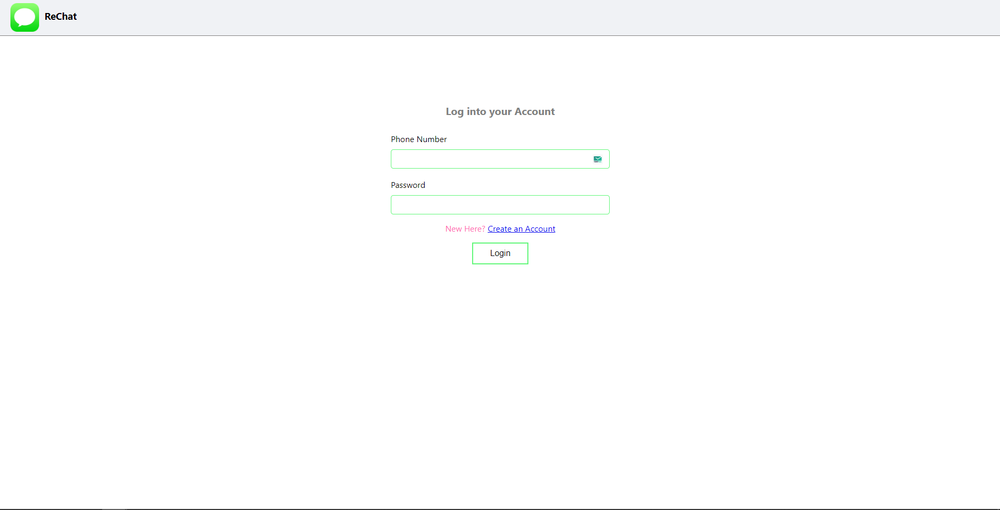
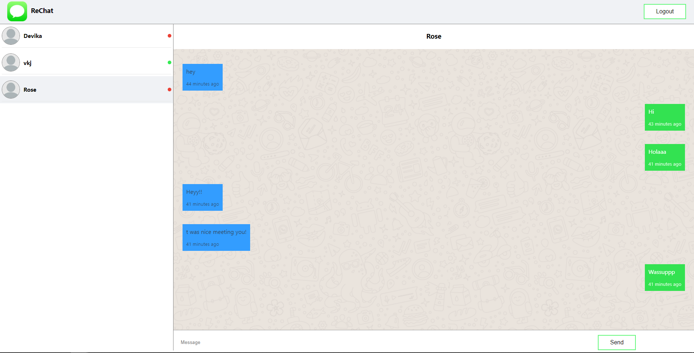

# ReChat

A simple private chat app built using ReactJs and Firebase that supports user authentication and Real Time Messaging.

### Screenshots:

### Feautures

- Real Time Messaging
- User Authentication Using Phone Number and Password
- Mobile Number as username
- Message History is preserved

### App Creation/Thought Process

Base template was made using the create-react-app environment. Implementation of features and designs were done with reference from various sources including but not limited to React and Firebase Official Documentations. Design Inspirations were taken from Whatsapp Web with the user list being in the left pane and the chat box at the right accompanied by the username at the top. Deployment was done using Vercel.

### Demo

- Live Demo: https://mv-rechat.vercel.app
- Video Demo: https://drive.google.com/file/d/1Ii6iED0Nv9Vw5tBETr7gwroIYVW7MIgG/view?usp=sharing
